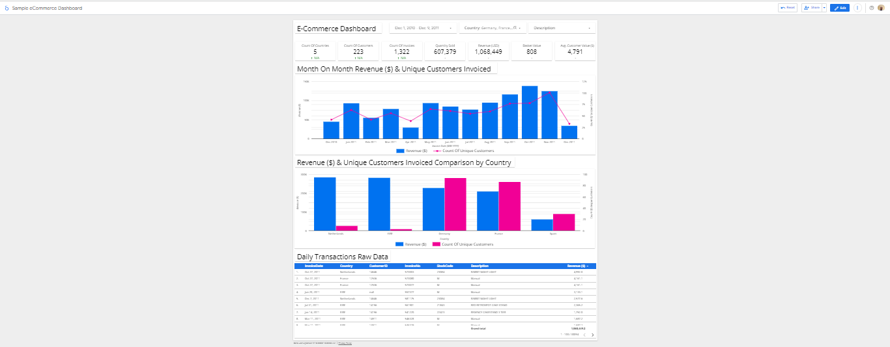

# Project: Ecommerce Dashboard

## Table of Contents
- [Project Description](#Project-Description)
- [Data Source Description](#Data-Source-Description)


# Project Description
* We leverage the power of `Google BigQuery` to store a sample Ecommerce data, retrieve the data using a `Connector` and finally perform visualization using the `Google Looker Studio`.

# Data Source Description
* Check out the [My Datasets Repo for a list of datasets](https://github.com/nyangweso-rodgers/Data_Analytics/tree/main/Datasets) for various analysis. In this project, we use the [online-retail.csv](https://raw.githubusercontent.com/nyangweso-rodgers/Data_Analytics/main/Datasets/online-retail.csv) sample data.

# Exploratory Data Analysis with `BigQuery` standard `sql`
* Using `count()` function to get the number of records in the dataset.

    ```sql
        -- count the number of records in the dataset
        select count(*) from FROM `general-364419.table_uploads.online_retail` 
        -- Output: 536,641
    ```

# Analysis
* Sales Summary which shows
   * Scorecards wth the following Metrics
      1. Count Of Countries (38)
      2. Count Of Customers (4,339)
      3. Count Of Invoices Generated (20,728)
      4. Quantity Sold (5,645,017)
      5. Revenue ($ 10,619,983)
      6. Basket Value ($512) : _average sales invoice value_
      7. Average Customer Value ($2,448): _average customer spend_2

    * Monthly Trend Analysis
      1. Revenue trend: (_Nov.2021 had the highest Revenue at $1.5_)
      2. Unique Customers Invoiced trend
    
    * Comparison Analysis

* Retention Analysis which shows
    * Monthly Cohort Retention: 
      * shows the count and prcent of returning customers after joining month.
# Links
* Looker Studio Dashboard:
    1. [Sales Summary](https://lookerstudio.google.com/reporting/86462191-b7d1-4808-ae55-21c8126c5d8d/page/k5SWD)
    2. [Monthly Cohort Retention Analysis](https://lookerstudio.google.com/reporting/86462191-b7d1-4808-ae55-21c8126c5d8d/page/p_unzspo5u7c)

* Looker Studio Data Source Links (these are `sql` scripts)
    1. [Sales Summary](https://lookerstudio.google.com/datasources/28765f40-c49f-4980-bacd-c80fbbed07a5)

    2. [Monthly Cohort Retention](https://lookerstudio.google.com/datasources/6b8c22a0-890d-4373-91b1-812f2dc2f340)




